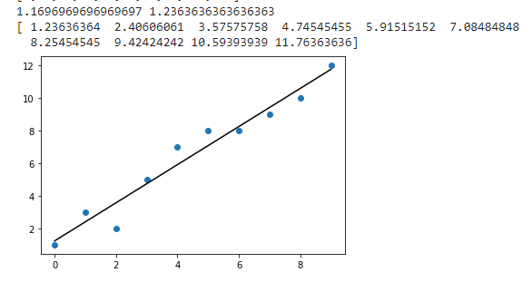

# Implementation of Univariate Linear Regression
## Aim:
To implement univariate Linear Regression to fit a straight line using least squares.
## Equipment’s required:
1.	Hardware – PCs
2.	Anaconda – Python 3.7 Installation / Moodle-Code Runner
## Algorithm:
1.	Get the independent variable X and dependent variable Y.
2.	Calculate the mean of the X -values and the mean of the Y -values.
3.	Find the slope m of the line of best fit using the formula.
 
4.	Compute the y -intercept of the line by using the formula:
  
5.	Use the slope m and the y -intercept to form the equation of the line.
6.	Obtain the straight line equation Y=mX+b and plot the scatterplot.
## Program
```
Program for Univariate linear regression using the least squares method.
Developed by: VALASAREDDY PALLAVI
RegisterNumber: 21002343

import numpy as np
import matplotlib.pyplot as plt
# Preprocessing Input data
x = np.array(eval(input()))
y = np.array(eval(input()))
# Building the model
# write your code here
xmean=np.mean(x)
ymean=np.mean(y)
num,den=0,0
for i in range(len(x)):
  num +=(x[i]-xmean)*(y[i]-ymean)
  den +=(x[i]-xmean)**2
m=num/den  
c=ymean-m*xmean #y=mx+c
print (m, c)
#Predict the output
y_pred=m*x+c
print (y_pred)
plt.scatter(x,y)
plt.plot(x,y_pred,color="black")
plt.show()
```
## Sample Input and Output

## Output

## Result
Thus the univariate Linear Regression was implemented to fit a straight line using least squares.
